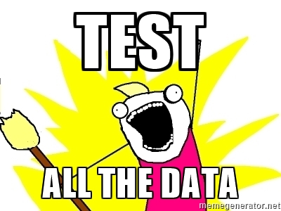

## About Me

- PhD Candidate, MIT Biological Engineering. \pause
- I play with statistics and biological data. \pause
- I think you need to write tests for your data.

## Why?

1. You have data. \pause
2. You have assumptions of your data. \pause
3. You will modify your data, making more assumptions about that data. \pause

**The data do not always follow your assumptions!**

## Example

- Data: one column needs to be log10-transformed.
- Assumptions? 
    - `dtype`? 
    - `range`?

# HOW?!

## Step 1: Install `py.test`

```bash
$ pip install pytest
```

## Step 2: Create your test script.

```bash
$ touch test_data.py
$ nano test_data.py
```

## Step 3: Make your script read data.

```python
import pandas as pd
data = pd.read_csv('data.csv')
```

## Step 4: Write your test functions.

```python
def test_column_is_correct():
    assert data[‘column’].dtype == float
    assert data[‘column’].min() > 0

def test_data_state_integrity():
    assert ‘log10_col’ not in data.columns
```

## Step 5: Run your tests.

```bash
$ py.test
```

## Step 6: Scream at your data provider.

- Actually, talk nicely `:)` \pause
- Discuss why data test failed. \pause
- Fix data. \pause
- Test again. \pause

Rinse and repeat. \pause

You’ll never have enough data tests!

## Benefits

- An automated contract between yourself, your future self, and others on your team. \pause
- Encodes your sanity checks on the data, so you don't have to remember them individually the future. \pause
- If data changes, you have a check for integrity.

## Conclusion

